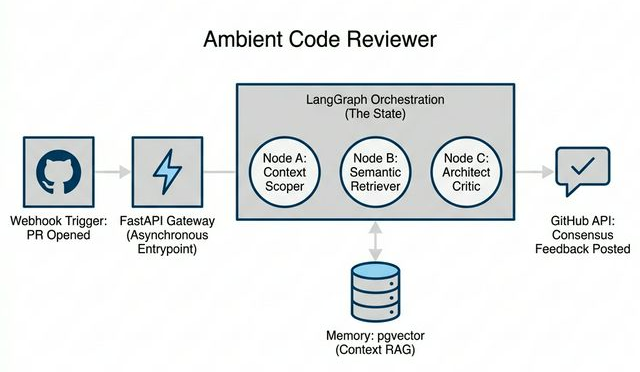

# 🤖 Ambient Code Reviewer

> Powered by **FastAPI · LangGraph · Gemini 2.5 · pgvector · Redis · Celery**


---

## 🌟 Overview

The **Ambient Code Reviewer** is an autonomous AI agent that monitors your GitHub repositories and provides instant, context-aware architectural reviews on every Pull Request. Unlike generic linters, it understands your team's internal **Architecture Decision Records (ADRs)**, design patterns, and private engineering documentation via RAG (Retrieval-Augmented Generation).

### ✨ Key Features

-   **🧠 Intelligent Context**: Uses **pgvector** to retrieve relevant internal documentation for every code change.
-   **⚡ Agentic Workflow**: Orchestrated by **LangGraph** for multi-step reasoning: *Fetch → Mask → Retrieve → Analyze → Post*.
-   **💎 Gemini-Powered**: Leverages **Gemini 2.5 Flash-Lite** for ultra-low latency, high-quality architectural critique.

-   **🛡️ Security First**: Integrated **PII & Secret masking** pre-processor ensures sensitive data never leaves your environment.
-   **🏗️ Enterprise Ready**: Robust background processing via **Celery & Redis** with automatic retries and horizontal scalability.

---

## 🏗️ Architecture




---

## 🚀 Quick Start

### 1. Configure the Environment

Copy the example environment file and fill in your credentials.

```bash
cp .env.example .env
# Fill in: GOOGLE_API_KEY, GITHUB_WEBHOOK_SECRET, GITHUB_TOKEN
```

### 2. Launch with Docker

The entire stack (API, Worker, DB, Redis) is containerized for easy deployment.

```bash
docker-compose up --build -d
```

| Service | Port | Description |
| :--- | :--- | :--- |
| **FastAPI** | `8000` | Webhook receiver & Health probe |
| **PostgreSQL**| `5432` | pgvector storage for RAG |
| **Redis** | `6379` | Celery broker |

### 3. Ingest Your Knowledge Base

Place your ADRs, design docs, or pattern guides (`.md`, `.txt`) in the `docs/` folder, then run:

```bash
docker-compose exec api python -m scripts.ingest_docs --docs-dir docs/
```

---

## 🛠️ Configuration

| Variable | Default | Description |
| :--- | :--- | :--- |
| `GOOGLE_API_KEY` | — | Your Google AI API key (Gemini) |
| `DATABASE_URL` | — | pgvector connection string |
| `REDIS_URL` | — | Redis broker connection string |
| `GITHUB_WEBHOOK_SECRET`| — | HMAC secret for webhook validation |
| `GITHUB_TOKEN` | — | GitHub PAT for posting PR comments |
| `EMBEDDING_PROVIDER` | `gemini`| `gemini` (uses gemini-embedding-001 at 768-dim) |


---

## 🤝 Contributing

Contributions are welcome! Please feel free to submit a Pull Request or open an issue for any bugs or feature requests.

## 📄 License

This project is licensed under the MIT License. See the [LICENSE](LICENSE) file for details.
